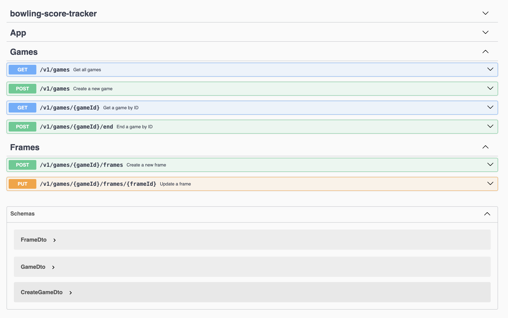
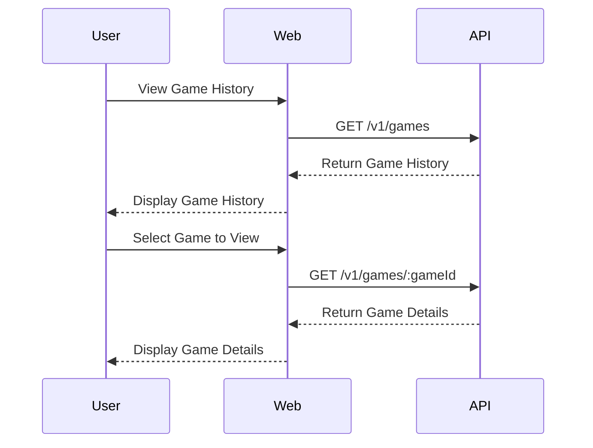

# Bowling Score Tracker

This project is a monorepo project built with Turbo. All apps are setup follows [12 Factor App](https://12factor.net/) principles.

## Getting Started

System requires Node 20.0.0 or higher.

First, install the dependencies

```bash
npm install
```

Second, create .env variables

```bash
cd apps/web
cp .env.example .env

cd ../api
cp .env.example .env
cd ../../
```

Then, run the development server

```bash
npm run dev
```

Or, run the development server with docker compose

```bash
docker compose up
```

## What's inside?

This Turborepo includes the following packages/apps:

### Apps and Packages

```bash
.
├── apps
│   ├── api                       # NestJS app (https://nestjs.com).
│   └── web                       # Next.js app (https://nextjs.org).
└── packages
    ├── @repo/eslint-config       # `eslint` configurations (includes `prettier`)
    ├── @repo/jest-config         # `jest` configurations
    ├── @repo/typescript-config   # `tsconfig.json`s used throughout the monorepo
    ├── @repo/ui                  # Shareable stub React component library.
    └── @repo/util                # Shared business logic, helpers, etc.
```

Each package and application are 100% [TypeScript](https://www.typescriptlang.org/) safe.

### Commands

#### Run the development server

```bash
npm run dev        # run all packages & app in dev mode
npm run dev -w=api # run apps/api dev server
npm run dev -w=web # run apps/web dev server
```

#### Run unit tests

```bash
npm run test        # run all unit tests
npm run test:watch  # run all unit tests in watch mode
npm run test -w=api # run apps/api unit tests
npm run test -w=web # run apps/web unit test
```

#### Build apps & packages

```bash
npm run build        # build all apps & packages
npm run build -w=api # build apps/api
npm run build -w=web # build apps/web
```

## Technical Stack

- [Turbo](https://turbo.build/repo) : Monorepo (to manage multiple apps & packages with sharing configs & logics)
- [NestJS](https://nestjs.com/) : NodeJS Framework
- [NextJS](https://nextjs.org/) : React Framework
- [TailwindCSS](https://tailwindcss.com/) : CSS Framework
- [Prisma](https://www.prisma.io/) : ORM
- [Jest](https://jestjs.io/) : Unit Testing Framework
- [Playwright](https://playwright.dev/) : E2E Testing
- [Docker](https://www.docker.com/) : Containerization

## System Design

### API



### DB Schema

```prisma
model Game {
  id        String   @id @default(uuid())
  created_at DateTime @default(now())
  ended_at   DateTime?
  players   String
  frames    GameFrame[]
  scores    GameScore[]
}

model GameFrame {
  id          String  @id @default(uuid())
  frame_number Int
  roll_1      Int
  roll_2      Int?
  roll_3      Int?
  game_id     String
  game        Game    @relation(fields: [game_id], references: [id])
  player_order Int  
  @@unique([game_id, frame_number, player_order])
}

model GameScore {
  id          String  @id @default(uuid())
  total_score Int
  game_id      String
  game        Game    @relation(fields: [game_id], references: [id])
  player_order Int  
  @@unique([game_id, player_order])
}
```

### Flows

#### Start & Play Game

```mermaid
sequenceDiagram
    participant User
    participant Web
    participant API
    participant @repo/util/bowling-score

    User->>Web: Enter Player Names & Start Game
    Web->>API: POST /v1/games
    API-->>Web: Return GameID
    Web-->>User: Display Frame Sheet

    User->>Web: Roll Ball & Entering Frame Sheet
    Web->> @repo/util/bowling-score  : calculate Score
    API->> @repo/util/bowling-score  : validate Frame Data
    @repo/util/bowling-score -->> Web: real time score
    Web->>API: POST /v1/games/:gameId/frames
    Web->>API: PUT /v1/games/:gameId/frames/:frameId
    Web-->>User: Display Score in realtime

    User->>Web: End Game
    Web->>API: POST /v1/games/:gameId/end
    API->> @repo/util/bowling-score  : Calculate Final Score
    @repo/util/bowling-score -->> API: Final Score
    API-->>Web: Return Game Result
    Web-->>User: Display Final Score
```

#### View Game History



## Further Improvements

- E2E Testing
- CI/CD Pipeline
- Correlation ID
- Standard Rest API Response
- Logging
